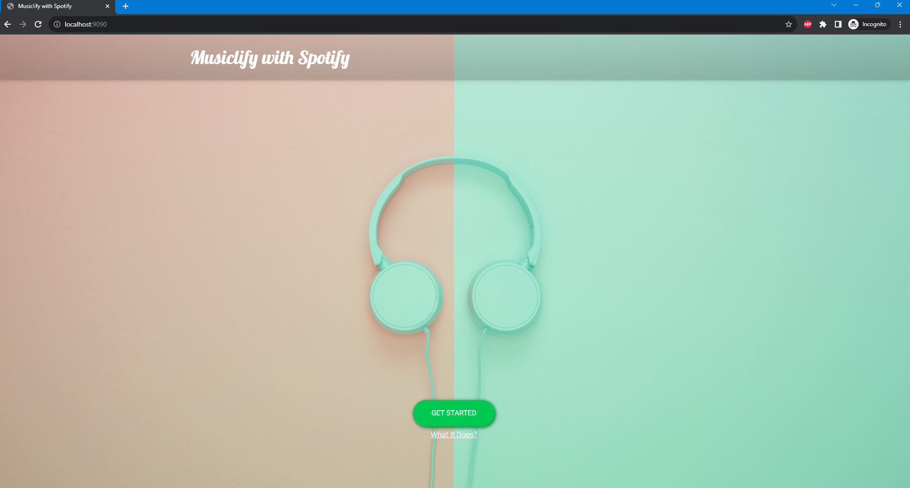
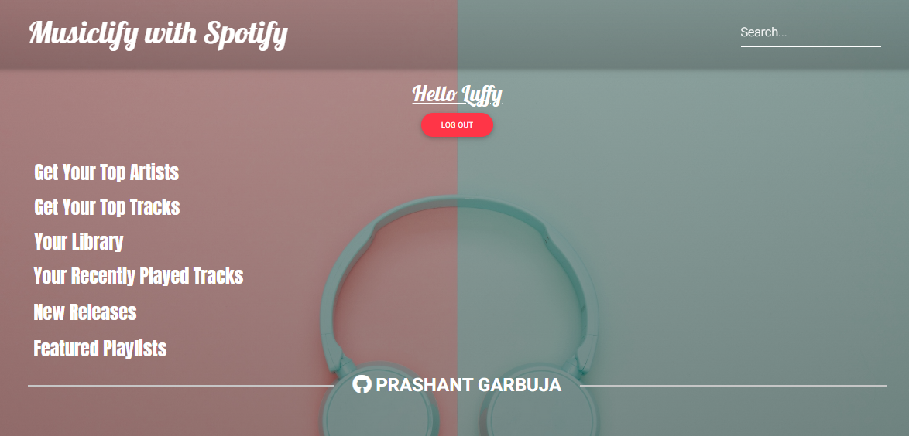

# Musiclify - Spring-Boot App with Spotify API (PKCE OAuth 2.0)

## [Live App](https://musiclify.prashantgarbuja.com/)

## Tech Stack
* Java 17
* Spring Boot 3.1.4
* Maven
* Spotify API
* Docker

## Dependencies
* Lombok
* Thymeleaf
* Spring Web
* Spring MVC
* Spring Configuration Processor (Dev tool)
* Spring Boot Dev Tools (Dev tool)

## Features
* Top played tracks of all time/past 6 months/past month
* Top played artists of all time/past 6 months/past month
* Show recently played tracks
* Saved albums
* Saved tracks
* Newest released tracks
* Featured playlists
* Current playing track
* Searched tracks/playlist/artists

## Resources

* [Spotify API Docs](https://developer.spotify.com/documentation/web-api/)
* [Spotify OAuth flow (PKCE)](https://developer.spotify.com/documentation/general/guides/authorization-guide/)
* [Proof-Key-For-Code Exchange (PKCE) Docs](https://datatracker.ietf.org/doc/html/rfc7636)
* [RestTemplate: Guide](https://www.baeldung.com/rest-template)
---

## Spotify App Setup 
* Get Started [here.](https://developer.spotify.com/documentation/web-api/tutorials/getting-started#create-an-app)
* After the creation of an app, retrieve **Client ID** and **Client Secret** from your app settings.
* Set Redirect URL to http://localhost:9090/callback or your_site/callback
* Configure your application.properties file
```
com.prashant.musiclify.app.client-id = <Client ID>
com.prashant.musiclify.app.redirect-url = http://localhost:9090/callback
server.port=9090
```

# Run the application using the Docker File
- DockerFile is created on the root folder, customize it as per your settings.
- Make sure you have [Docker](https://docs.docker.com/get-docker/) installed in your system.
- Go to the command prompt and cd to your file path.
- Build your docker image (image name: musiclify, tag: version_1).
```
docker build -t musiclify:version_1 .
```
- Check if the docker image (musiclify) is created.
```
docker images
```
- After verifying, run the docker image on port 9090 (any port but since the Spotify callback redirect URL is configured with port 9090 above).
```
docker run -d -p 9090:9090 musiclify
```
- To check if the container is up and running.
```
docker ps
```

Now to check your application go to the local host via port 9090:
```
http://localhost:9090/
```

# Screenshots





